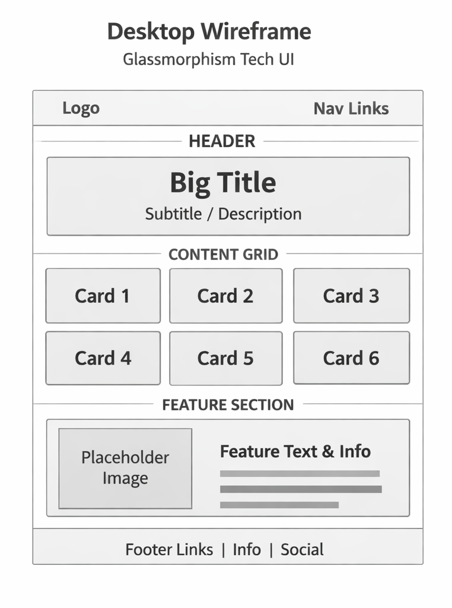
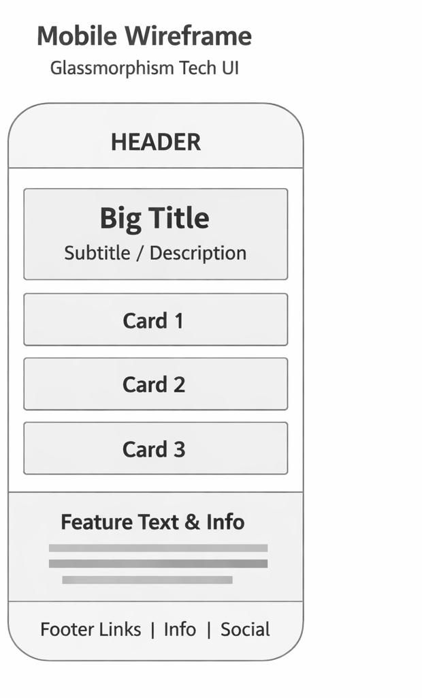

# Style Stage Submission

## Group Information
- **Group Name:** Group 1
- **Contributor:** Victoria Amanam
- **Theme Name:** Stage Spotlight

---

## Theme Description

**Stage Spotlight** is a modern, theatrical CSS showcase that transforms the Style Stage with:

- **Dark Backgrounds** with deep, sophisticated coloring that evokes a theatrical stage
- **Glass UI Effects** featuring frosted backdrop blur for a premium, contemporary feel
- **Gold & Purple Accents** providing theatrical elegance and visual hierarchy
- **Smooth Animations** with fade-in effects and interactive hover states
- **Responsive Design** adapting seamlessly across mobile, tablet, and desktop
- **Professional Typography** using Space Grotesk for modern, clean readability

The design philosophy combines CSS-first innovation with accessibility, showcasing modern layout techniques and visual effects while maintaining semantic HTML integrity.

---

## Technologies & Techniques Used

### Core Technologies
- **Sass/SCSS** - CSS preprocessing with variables, mixins, and modular organization
- **CUBE CSS Methodology** - Organized folder structure:
  - `global/` - Resets, typography, theme variables
  - `composition/` - Layout patterns and global styles
  - `blocks/` - Component-specific styling
  - `utilities/` - Reusable helper classes and mixins

### CSS Features
- **CSS Grid** - Multi-column responsive layouts
- **Flexbox** - Content alignment and navigation spacing
- **CSS Variables (Custom Properties)** - Dynamic theming and maintainability
- **Backdrop-filter** - Glass morphism effects with blur
- **CSS Animations & Transitions** - Smooth, performance-optimized interactions
- **Radial Gradients** - Decorative glowing effects
- **Media Queries** - Responsive breakpoints (768px+)

### Accessibility & Best Practices
- Semantic HTML without modifications
- Skip link for keyboard navigation
- Sufficient color contrast
- Focus states for interactive elements
- Responsive typography with fluid scaling

---

## Color Palette

| Purpose | Color | Hex Code |
|---------|-------|----------|
| Primary Accent | Gold | `#f0c95b` |
| Primary Alt | Light Gold | `#fbe8b2` |
| Secondary | Purple | `#8e73ff` |
| Background | Dark | `#070914` |
| Text | Light | `#f3f4fb` |
| Glass BG | White Transparent | `rgba(255, 255, 255, 0.1)` |
| Glass Border | White Transparent | `rgba(255, 255, 255, 0.2)` |

---

## Typography

- **Font Family:** Space Grotesk (Google Fonts)
- **Font Weight:** 400, 500, 600, 700
- **Heading Sizes:**
  - H1: `clamp(2rem, 7vw, 5.5rem)`
  - H2: `clamp(2rem, 4vw, 2.75rem)`
  - H3: `2rem`
  - H4: `1.3rem`
- **Body Text:** `1.1rem`

---

## Responsive Breakpoints

### Mobile (< 768px)
- Single-column layout
- Touch-friendly spacing
- Optimal text sizing
- Adjusted padding for smaller screens

### Desktop (768px+)
- Two-column grid layout
- Enhanced spacing
- Full glass effects
- Hover animations active

---

## Key Features & Animations

### Glass UI Effect
```scss
background: rgba(255, 255, 255, 0.1);
backdrop-filter: blur(10px);
border: 1px solid rgba(255, 255, 255, 0.2);
border-radius: 16px;
```

### Fade-In Animation
Sections fade in on page load with staggered delays (0.2s, 0.4s, 0.6s)

### Hover Interactions
- Sections lift upward: `transform: translateY(-8px)`
- Shadow enhancement on hover
- Smooth 0.3s transitions

### Glow Effects
- Background radial gradients with gold and purple
- Fixed blur glows positioned off-screen
- Atmospheric depth and visual interest

---

## File Structure

```
c:\Users\USER\Desktop\Style-stage-new\
├── public/
│   ├── index.html          # Base HTML (unmodified)
│   └── style.css           # Compiled stylesheet
├── sass/
│   ├── style.scss          # Main import file
│   ├── global/
│   │   ├── _theme.scss     # Colors & variables
│   │   ├── _fonts.scss     # Font imports
│   │   ├── _reset.scss     # CSS reset
│   │   └── _typography.scss
│   ├── composition/
│   │   ├── _layout.scss    # Grid & layout
│   │   └── _styles.scss    # Global animations
│   ├── blocks/
│   │   ├── _header.scss
│   │   ├── _nav.scss
│   │   ├── _footer.scss
│   │   ├── _about.scss
│   │   ├── _profile.scss
│   │   └── _links.scss
│   └── utilities/
│       └── _mixins.scss
├── wireframes/
│   ├── desktop-wireframe.md
│   └── mobile-wireframe.md
├── SUBMISSION.md           # This file
├── package.json
└── README.md
```

---

## Wireframes

### Desktop Wireframe (1200px)


*Two-column grid layout with header, navigation, 4 glass cards, and footer*

### Mobile Wireframe (375px)


*Single-column responsive layout optimized for touch on small screens*

---

## Wireframe Details

---

## Design Highlights

✨ **Premium Feel**
- Glass morphism trending design pattern
- Sophisticated color scheme
- Smooth, performant animations

🎭 **Theatrical Theme**
- Dark stage setting
- Gold highlighting (spotlight)
- Purple accents (dramatic flair)

📱 **Fully Responsive**
- Mobile-first approach
- Flexible grid system
- Touch-friendly interactions

♿ **Accessibility**
- Semantic HTML preserved
- Keyboard navigation support
- High contrast colors
- Focus states visible

⚡ **Performance**
- Optimized CSS (no prefixes needed)
- Unminified for learning
- Efficient animations
- No external images or assets

---

## Testing Checklist

- ✅ Responsive at 375px (mobile)
- ✅ Responsive at 768px (tablet)
- ✅ Responsive at 1200px+ (desktop)
- ✅ Glass effects visible on all screen sizes
- ✅ Animations smooth and performant
- ✅ Color contrast meets WCAG standards
- ✅ No HTML modifications
- ✅ CSS unminified and readable

---

## Live Deployment

### GitHub Pages URL
`https://[username].github.io/Style-stage-new/`

### Raw CSS URL (for submission)
`https://raw.githubusercontent.com/[username]/Style-stage-new/main/public/style.css`

---

## How to Build & View Locally

1. Clone the repository
2. Run `npm install` to install dependencies
3. Run `npm start` to start the dev server
4. Visit `http://localhost:1341` to view the site
5. Changes to Sass files auto-compile and refresh

---

## Skills Demonstrated

✅ **CSS Grid** - 2-column responsive layout  
✅ **Flexbox** - Navigation and content alignment  
✅ **CSS Variables** - Theme colors and glass effect values  
✅ **Animations** - Fade-in and hover effects  
✅ **Responsive Design** - Mobile-first approach  
✅ **Sass/SCSS** - Variables, nesting, mixins  
✅ **Modern CSS** - Backdrop-filter, CSS Grid, custom properties  
✅ **Accessibility** - Semantic HTML, keyboard nav, color contrast

---

## Author Notes
This submission showcases modern CSS techniques through a theatrical lens. The "Stage Spotlight" theme uses contemporary design patterns (glass UI) while maintaining a strong visual identity through color, animation, and typography. Special attention was given to responsive design and accessibility to ensure the showcase is both beautiful and usable for all visitors.

**Created by:** Victoria Amanam  
**Group:** Group 1  
**Date:** April 2026
